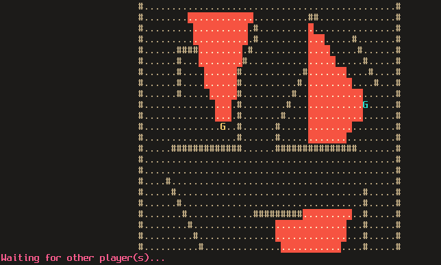
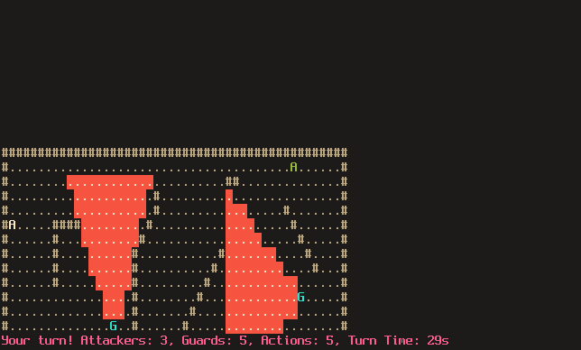
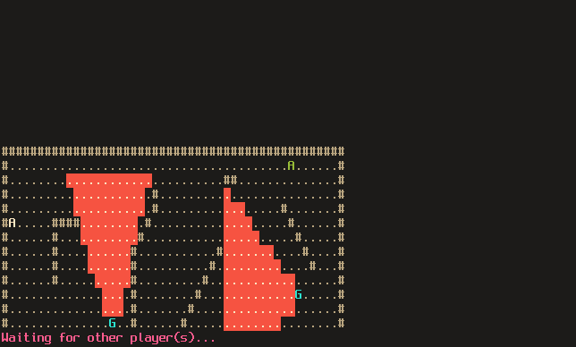

## Gameplay

The game is played between 1 *defender* and a number of stealthy *attackers*.
The defender controls a set of guards who can view parts of the map.
An attacker controls a single agent who must sneak past the guards to their
objective.

Various gameplay settings can be configured (server-side) in [hanzo.toml](./hanzo.toml).

### Defender

On a defender's turn they control the guards with the following actions:
- `TAB` to cycle through selected guard
- `LEFT` to move one tile left
- `RIGHT` to move one tile right
- `UP` to move one tile up
- `DOWN` to move one tile down
- `[` to rotate field-of-view anti-clockwise
- `]` to rotate field-of-view clockwise

A defender has a fixed number of actions per turn (not including cycling through their guards).

To eliminate an attacker, a guard must manoeuvre such that an attacker would take
3 or more moves to escape their line-of-sight. Note an attacker is only visible to
the defender if they're within a guard's line-of-sight.

When it is not their turn they will be presented with a waiting screen:

### Attacker

On an attacker's turn they control a single agent with the following actions:
- `LEFT` to move one tile left
- `RIGHT` to move one tile right
- `UP` to move one tile up
- `DOWN` to move one tile down
- `[` to rotate field-of-view anti-clockwise
- `]` to rotate field-of-view clockwise

An attacker has a fixed number of actions per turn.

To eliminate a guard, an agent must manoeuvre to occupy the same tile as the guard.

When it is not their turn, or if they have been eliminated,
they will be presented with a waiting screen:

#### Win conditions

For the defender:
- eliminate all the attackers

For the attacker(s):
- all attackers reach their objective locations, or,
- eliminate all the guards

#### Legend

- `.` floor tile
- `#` wall tile
- `A` an agent
- `G` a guard
- `X` an objective location
